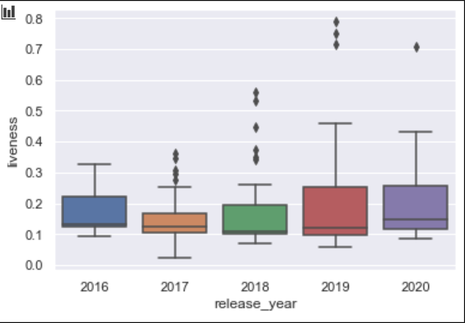

# Digital Humanities 100 - Spotify Streaming Music Analysis

## Introduction:

The music streaming industry has revolutionized the way music is consumed by listeners. In particular, it has has profoundly increased consumption of hip-hop tracks. Individual artists hold significant influence over their careers, especially in a post-label market. Through platforms such as Soundcloud, Youtube, Spotify, Apple Music, Tidal, and Social Media platforms, each artist has the ability to connect and share their music with millions of fans across the world.

The goal of this project is to understand how track lyrics and popularity have evolved over the last four years with the help of streaming services.

## Data Setup

**Spotipy** is a lightweight Python library for the Spotify Web API. With Spotipy you get full access to all of the music data provided by the Spotify platform.

I am using Spotipy APIs to get streaming data and audio information for the top streaming tracks. 

Here, I am installing the unofficial Spotify Charts API. It shows any and all data for top 200 and viral 50 music on Spotify. Here are the links to fycharts (https://pypi.org/project/fycharts/) & (https://github.com/kelvingakuo/fycharts#utils). 

**Fycharts** is "A fully-fledged installable python package for extracting top 200 and viral 50 charts off of spotifycharts.com"

In a nutshell, the unofficial Spotify Charts API.

The **top200Weekly** function is the main data extractor function for top streaming tracks. 

In this function, we are checking the following

1. If the charts data file (A) from 'start date` to `end date` exists 
2. Is the corrosponding spotify file (B) for the top 200 weekly songs from the above list exist. 
3. If B exist, we have all the data for the top 200 songs for start data and end data. We read B in a dataframe and return
4. If B doesn't exist, then check if A exist. If A exists, then read A. Else call the Charts API get the top 200 songs from the charts and write it to a file. 
5. Once we have read A, then for each song in the chart, call the spotify api, to get the details of the song, the audio features and then write all the data to an file , which will be the B file. Next time for the same start date and end date, we don't have to do this process, we can read directly off the file. 

The Audio Features function extracts the audio features from Spotify for a track. The audio features I get are as follows:

* Acousticness
* Danceability
* energy
* instrumentalness
* liveness
* loudness
* speechiness
* tempo
* valence

Additionally, for each track I am getting the following information from Spotify Charts and Spotify

1. Artist Name
2. Duration
3. Album Release Date
4. Album Type
5. Album Name
6. Popularity
7. Position in the Weekly Charts
8. Number of Streams

For my project, For every quarter, I chose the top 10 from the top 200 songs from Spotify. I used the years 2017, 2018, 2019, and 2020

The reason I went with every quarter, is because the top songs in the charts remain in the charts for a quarter.

I also save the songs dataframe CSV file, so I don't have to extract the data from the Spotify APIs every time I run the program. This saves a lot of time.

## Understanding the Data
The data that you are seeing here is the artist, position, number of streams, audio features, album details, popularity, duration of the song, release date of the track. 

Sorting by duration of the tracks. Shortern songs does not necessarily mean that there is a lower number of streams. And conversely, longer songs don't have more number of streams.

Additionally, more songs in 2019 and 2020 have shorter duration.

Drop duplicate tracks from the Dataframe. The final track dataframe size is now 124 rows. 

## Analysis

Firt we are importing seaborn and matplotlib for our data visualizations.

We group the tracks by release year and find the min, max and mean duration of the tracks in minutes. We plot the data and we see the duration is dropping over the last 4 years. We don't have all the data for 2020, hence the dataset plot in not complete for 2020.

### Genre fluidity and Audio analysis.
According to my hypothesis, because of streaming and the way songs are consumed, the songs have more dancibility and liveness, irrespective of the genre the songs belonglink text to (ie Hip Hop, Pop etc. )

All 150 songs over the 4 years.

Next, I would like to see the change in liveleness and tempo over the years using the box plot. This graph compares release_year and liveleness of the same songs and we see there are some outliers, but the average liveleness is increasing over the years. Also the variation in liveliness (size of the box) is almost similar, which means all songs trying to get to the same level of liveliness, irrespective of the genre.

This graph compares release_year and tempo of the same songs and we see the average tempo is increasing over the years. Also the variation in tempo (size of the box) is reducing, which means songs trying to get higher tempo to increase their popularity. 

This scatter plot graph looks at the danceability of the songs with the number of streams. We can visualize the the songs are clustered with a mean danceability of 0.7-0.9, for streams of 0.75-1.0 m .

This scatter plot graph looks at the speechiness of the songs with the number of streams. We can visualize songs are less speechy, which could be more beats and repetition of lyrics. 

## End Genre fluidity and Audio analysis.

Using the data from Spotify charts, streams, positions and audio features, we are able to arrive at the conclusion that irrespective of genres, the songs are getting smaller for higher number of streaming, and the audio analysis shows that songs want to have the similar audio characteristics in order to maintain their chart positions.

## Lyrical Analysis

Here, we are using a selected four random songs from the top streaming songs and pulling the lyrics from genius and beautifulsoup for lyrical analysis.

The approach to lyrical analysis is as follows. 

1. Data extraction

    * Genius API to pull the lyrics for the tracks
    * Beautiful soup to parse the content
    * Create a dataframe with the artist name, track name, lyrics
    * Save the dataframe to csv file.
2. Data preparation
    * Removing stopwords
    * Stemming,
    * Removing punctuations,
    * and then tokenizing them.
3. Use Wordcloud to visualize Top 25 Words in Songs

4. Topic Modeling using TF-IDF Vectorizer

    * Extract the top features
    * Rank them based on the scores
    * Use LDA to do Topic Modeling, to extract the main topics
    * Use NMF to do Topic Modeling

5. Cosine Similarity Similarity of the tracks in a 4x4 matrix

## End of Lyrical Analysis
The topic modeling of the lyrics shows topics which are top 10 topics , keywords for each topic and the weightage(importance) of each keyword and words which are closer to other words in the topic.

## Conclusion

From these visualizations and interpretations, I hope viewers can gain an understanding about the the impact the streaming industry has had on musical development - both from the production and lyrical sides. The streaming industry has given artists creative control over their tracks and marketing. Artists now have data about the type of content their fans want to listen to and where their fans are listening from.

Furthermore, the two questions that I set out to answer were:

How has music’s sound and genre fluidity evolved since the prominence of the streaming industry?
How has the lyrical components and musical themes changed since the prominence of the streaming industry?
In response to the first question, music’s sound has changed with an emphasis on beats. Songs are shorter in length and albums have more tracks. Genre lines are no longer clearly defined as artists are more versatile in their craft.

In response to the second question, musical themes and lyrical components have changed as artists prefer repetetion, increased danceability, and liveliness in their sounds. The song topics and themes are quite similar (as seen in the topic modeling above).

In the future, I would like to add a sentiment analysis component. I would add tweets about a specific track and compare it to critics’ reviews. I would love to go forward with this project and would welcome any feedback!

Contact: rishabhparekh@berkeley.edu
